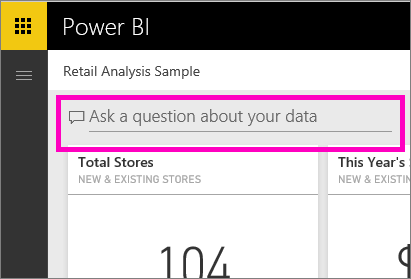

# Tutorial: How to use Q&A to create visualizations and build reportsTutorial: How to use Q&A to create visualizations and build reports
Thtroduced you to Power BI Q&A and made the distinction between *consumers* (have dashboards and reports shared with them) and *creators* (own the underlying reports and datasets).Thtroduced you to Power BI Q&A and made the distinction between *consumers* (have dashboards and reports shared with them) and *creators* (own the underlying reports and datasets). The first part of this tutorial is designed primarily for people consuming dashboards using Power BI service.The first part of this tutorial is designed primarily for people consuming dashboards using Power BI service. And the second part is designed for people creating reports using either Power BI service or Power BI Deske covered in separate articles.And the second part is designed for people creating reports using either Power BI service or Power BI Deske covered in separate articles.

Q&A is interactive and even fun, and, more often than not, one question will lead to many others as the visualizations reveal interesting paths to pursue.Q&A is interactive and even fun, and, more often than not, one question will lead to many others as the visualizations reveal interesting paths to pursue. Watch Amanda demonstrate using Q&A to create visualizations, dig into those visuals, and pin them to dashboards.Watch Amanda demonstrate using Q&A to create visualizations, dig into those visuals, and pin them to dashboards.

<iframe width="560" height="315" src="https://www.youtube.com/embed/qMf7OLJfCz8?list=PL1N57mwBHtN0JFoKSR0n-tBkUJHeMP2cP" frameborder="0" allowfullscreen></iframe>

## Part 1: Use Q&A on a dashboard in Power BI service (app.powerbi.com)Part 1: Use Q&A on a dashboard in Power BI service (app.powerbi.com)
A dashboard contains tiles pinned from one or more datasets, so you can ask questions about any of the data contained in any of those datasets.A dashboard contains tiles pinned from one or more datasets, so you can ask questions about any of the data contained in any of those datasets. To see what reports and datasets were used to create the dashboard, select **View related** from the menubar.To see what reports and datasets were used to create the dashboard, select **View related** from the menubar.

The Q&A question box is located in the upper-left corner of your dashboard, and this is where you type your question using natural language.The Q&A question box is located in the upper-left corner of your dashboard, and this is where you type your question using natural language. Q&A recognizes the words you type and figures out where (which dataset) to find the answer.Q&A recognizes the words you type and figures out where (which dataset) to find the answer. Q&A also helps you form your question with auto-completion, restatement, and other textual and visual aids.Q&A also helps you form your question with auto-completion, restatement, and other textual and visual aids.

The answer to your question is displayed as an interactive visualization and updates as you modify the question.The answer to your question is displayed as an interactive visualization and updates as you modify the question.

1. Open a dashboard and place your cursor in the question box.Open a dashboard and place your cursor in the question box. Even before you start typing, Q&A displays a new screen with suggestions to help you form your question.Even before you start typing, Q&A displays a new screen with suggestions to help you form your question. You'll see the names ofYou'll see the names of

   

   You can always choose one of these questions as a starting point and continue to refine the question to find the specific answer you are looking for.You can always choose one of these questions as a starting point and continue to refine the question to find the specific answer you are looking for. Or, use a table name to help you word a new question.Or, use a table name to help you word a new question.

2. Select from the dataset options or begin typing your own question and select from the dropdown suggestions.Select from the dataset options or begin typing your own question and select from the dropdown suggestions.

   

3. As you type a question, Q&A picks the bion changes dynamically as you modify the question.As you type a question, Q&A picks the bion changes dynamically as you modify the question.

   

4. When you type a question, Power BI looks for the best answer using any dataset that has a tile on that dashboard.When you type a question, Power BI looks for the best answer using any dataset that has a tile on that dashboard.  If all the tiles are from *datasetA*, then your answer will come from *datasetA*.If all the tiles are from *datasetA*, then your answer will come from *datasetA*.  If there are tiles from *datasetA* and *datasetB*, then Q&A will search for the best answer from those 2 datasets.If there are tiles from *datasetA* and *datasetB*, then Q&A will search for the best answer from those 2 datasets.

   > [!TIP]
   > So be careful, if you only have one tile from *datasetA* and you remove it from your dashboard, Q&A will no longer have access to *datasetA*.So be careful, if you only have one tile from *datasetA* and you remove it from your dashboard, Q&A will no longer have access to *datasetA*.
   >
   >
5. When you're happy with the rerner.When you're happy with the rerner. If the dashboard has been shared with you, or is part of an app, you won't be able to pin.If the dashboard has been shared with you, or is part of an app, you won't be able to pin.

   

##    Part 2: Use Q&A in a report in Power BI service or Power BI DesktopPart 2: Use Q&A in a report in Power BI service or Power BI Desktop

Use Q&A to explore your dataset and to add visualizations to the report and to dashboards.Use Q&A to explore your dataset and to add visualizations to the report and to dashboards. A report is based on a single dataset and may be completely blank or contain pages full of visualizations.A report is based on a single dataset and may be completely blank or contain pages full of visualizations. But just because a report is blank, doesn't mean there isn't any data for you to explore -- the dataset is linked to the report and is waiting for you to explore and create visualizations.But just because a report is blank, doesn't mean there isn't any data for you to explore -- the dataset is linked to the report and is waiting for you to explore and create visualizations.  To see which dataset is being used to create a report, open the report in Power BI service Reading view and select **View related** from the menubar.To see which dataset is being used to create a report, open the report in Power BI service Reading view and select **View related** from the menubar.

In order to use Q&A in reports, you musrred to this as a *creator* scenario.In order to use Q&A in reports, you musrred to this as a *creator* scenario. So if you are, instead, *consuming* a report that has been shared with you, Q&A will not be available.So if you are, instead, *consuming* a report that has been shared with you, Q&A will not be available.

1. Open a report in Editing view (Power BI service) or Report view (Power BI Desktop) and select **Ask a question** from the menubar.Open a report in Editing view (Power BI service) or Report view (Power BI Desktop) and select **Ask a question** from the menubar.

    **Desktop**  **Desktop**    
    

    **Service**  **Service**    
    

2. A Q&A question box displays on your report canvas.A Q&A question box displays on your report canvas. In the example below, the question box displays on top of another visualization.In the example below, the question box displays on top of another visualization. This is fine, but it might be better to add a blank page to the report before asking a question.This is fine, but it might be better to add a blank page to the report before asking a question.

    

3. Place your cursor in the question box.Place your cursor in the question box. As you type, Q&A displays suggestions to help you form your question.As you type, Q&A displays suggestions to help you form your question.

   

4. As you type a question, Q&A picks thualization changes dynamically as you modify the question.As you type a question, Q&A picks thualization changes dynamically as you modify the question.

   

5. When you have the visualization you like, select ENTER.When you have the visualization you like, select ENTER. To save the visualization with the report, select **File > Save**.To save the visualization with the report, select **File > Save**.

6. Interact with the new visualization.Interact with the new visualization. It doesn't matter how you created the visualization -- all the same interactivity, formatting, and features are available.It doesn't matter how you created the visualization -- all the same interactivity, formatting, and features are available.

   

   If you've created the visualization in Power BI service, you caIf you've created the visualization in Power BI service, you ca

## Tell Q&A which visualization to use.Tell Q&A which visualization to use.
With Q&A, not only can you ask your data to speak for itself, you can tell Power BI how to display the answer.With Q&A, not only can you ask your data to speak for itself, you can tell Power BI how to display the answer. Just add "as a <visualization type>" to the end of your question.Just add "as a <visualization type>" to the end of your question.  For example, "show inventory volume by plant as a map" and "show total inventory as a card".For example, "show inventory volume by plant as a map" and "show total inventory as a card".  Try it for yourself.Try it for yourself.

##  Considerations and troubleshootingConsiderations and troubleshooting
- If you've connected to a dataset using a live connection or gateway, Q&A needIf you've connected to a dataset using a live connection or gateway, Q&A need

- You've opened a report and don't see the Q&A option.You've opened a report and don't see the Q&A option. If you're using Power BI service, make sure the report is open in Editing view.If you're using Power BI service, make sure the report is open in Editing view. If you can't open Editing view it means you don't have edit permissions for that report and won't be able to use Q&A with that specificIf you can't open Editing view it means you don't have edit permissions for that report and won't be able to use Q&A with that specific 
